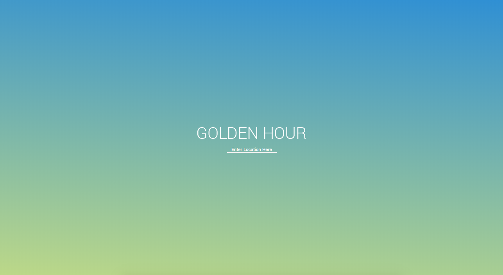
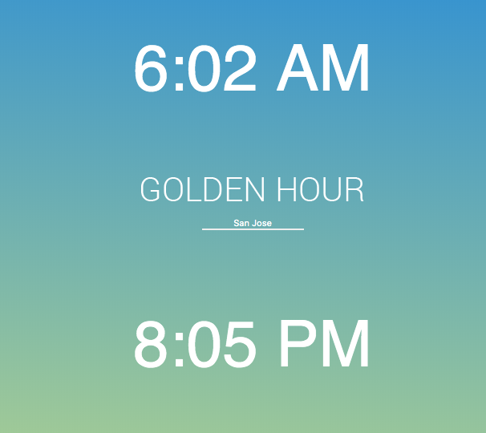

<h1 align='center'>Golden Hour</h1>

Live Demo: https://duyhtruong.github.io/sunrise-sunset

 
 

In photography, 'Golden Hour' is the period of time just after the sun rises and sets over the horizon. 
					Photographers love this time of day due to the diffused and even light, with reduced shadows and warm hues. 

						This minimal web app was created as a tool to help photographers take advantage of this lighting. The web
						app takes in a location as an input and returns the time the sun will rise and set in the location's local time.

						Sun rising and setting data was fetched from the sunrise-sunset API. Local time calculations were completed
						using Google Timezone API.

<strong>To Use:</strong>

					
					<ul>
						<li>Enter location in the search bar</li>
						<li>Click enter</li>
					</ul>
